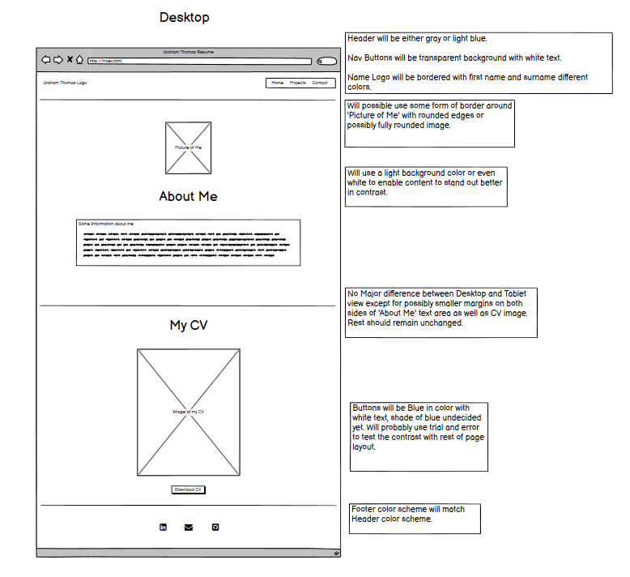
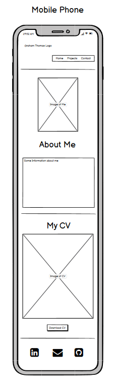
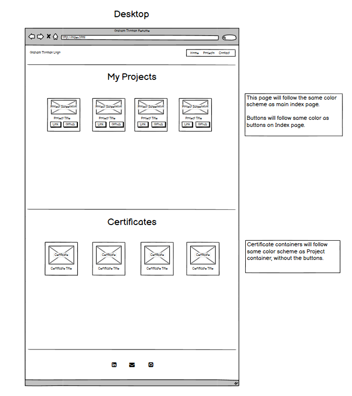
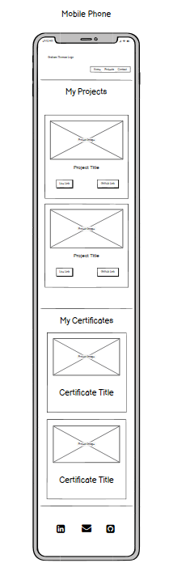
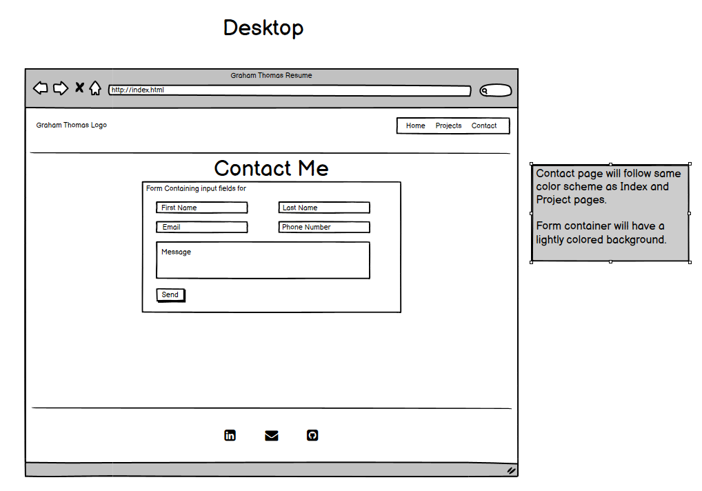
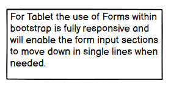
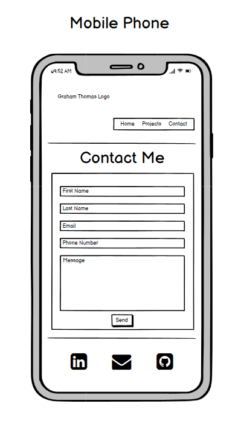

# Milestone Project 1

## Portfolio / Resume Project

### Strategy: 

I have decided that I will build a Resume / Portfolio website. The reason I have decided to do this project from the list of Project examples supplied by the course, is that I have made 3 other portfolio websites in the recent months before starting this course, but they have always been other peoples designs that have been copied through follow along videos on Youtube. I have always wanted to try and make one of my own design but never had the courage to start. 

This project will be for myself, the website will contain my own personal portfolio information which is real and not for a fictional person. Although the website will not immediately be used by myself in real life I may use it in the future as a structure to build upon and improve with the intention of possibly using it in real life circumstances. 

The goal of this website is to display my CV, a small text about myself and a live list of projects and  certifications that can be viewed by any potential employer. The projects, as well as having a live button to view the project will also have a button that will direct to the actual code that makes up the projects, which will be viewed through GitHub. There will also be a contact me page with a form for the potential employer to use to contact me through direct email message or via the use of social links which will be attached onto the footer of each page. 

### Scope: 

The website will have the standard header and footer on each page. The header will have some form of simple logo and navigational links to each web page.  
I have decided that I want to keep the project simple, aesthetically pleasing to the eye and try not to overthink the design past my current capabilities.
I know from watching design idea videos on Youtube that the majority of social media suggestions state that simple is best. The employer will only be interested in the basic layout and structure of your design (a responsive and working website) and will more likely be targeting your projects, certifications and code examples.
The website will be fully responsive to the best of my ability and will have all fully working Links/Buttons.

### Structure: 

The website structure will be kept simple and easy to navigate (for ease of use).

The main page will be kept simple with a small but non overpowering image of myself and below it a simple description of myself.
Below the about me section I will have an image of my real CV pdf that I created a few months ago and below that will be a working button to open and download that CV. 
 
The projects page will have a simple layout of bordered box around each project that will include a screenshot and title, also there will be two buttons within each project box that will link to both a live preview and the actual code displayed on GitHub. The certifications will also be displayed in a similar manner to the projects but without the navigational buttons. Each of the projects/certifications will be displayed side by side for the width of the page with small margin to separate each one.

The Contact page will also be kept very simple and will have a basic easy to use form which will include sections for first name, surname, email, phone number and finally a message section. There will be a submit button below the form. Haven’t fully decided if this will be a fully working form linked to a back-end yet as this would require the use of outside tutorials and help.  
 

### Skeleton: 

This website will be written using GitPod as per our course guidance so far. As suggested in our project ideas and overview, I have decided not to use GitHub pages to display my finished project. Instead I will be using Netlify which I have become very familiar with over the past few months whilst teaching myself to code. Netlify is easy to use and has a ton of great features including connecting to any GitHub repositary, Back-end email service, easy to drag and drop files/folders and free hosting.  

I will be using an easy to use wireframe design tool called Balsamiq to design my website and will be linking images of these designs below.

### Surface: 

As for the finished look of the project I am not fully decided on which fonts to use yet or which colors. I’m gonna use a long known procedure of try and test before I decide which I’m going to use. I do however know that I do not want to use any bright and bold colors, I want to stay within the borders of my already decided simple design, and keep the layout, colors and styles simple yet aesthetically pleasing to the eye. 
So far I’m thinking along the lines of light blues, greens and greys, with simple and bold text fonts.

### Wireframe of proposed website.

As I have never done a wireframe frame before it took a lot of research to figure out a simple tool to use for creating my wireframe. I decided to use Balsamiq as this look easy and simple to use compared to others I had found. Once I had created the wireframe for each page of my website I then had to figure out how I could show them on this ReadMe file, I decided to use my PC’s own snipping tool to copy sections of my wireframe  and save those sections as individual images. 

Below are those images. I have not incorporated any Tablet views into my wireframe due to the view that any tablet views would only be such small changes that those changes would not made any kind of real change in comparison to the desktop views. Instead I will write a small caption or text stating what those changes would be for the tablet view.

### For the main page or index.html page:

#### Desktop View

#### Tablet View

The changes between tablet and desktop view would in my opinion be very small, the only real changes would be the size of the side margins on the outside edge of the main content sections.
Everything else would remain the same.

#### Mobile View

### For the Projects page:

#### Desktop View

#### Tablet View

#### Mobile View

### For the Contact page:

#### Desktop View

#### Tablet View

#### Mobile View

